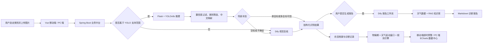

基于多模型协同的农作物病虫害智能识别与预测 LeafQuery

**从拍照识别到可解释预警的农作物病虫害智能服务平台**

[](https://openjdk.org/)
[](https://spring.io/projects/spring-boot)
[](https://vuejs.org/)
[](https://docs.ultralytics.com/)
[](https://www.mysql.com/)
[](https://dify.ai/)

</div>


## 项目简介

LeafQuery 面向种植户、农技人员与平台运营人员，将图像识别、大模型复核、知识检索、天气特征和农田档案组织为一条完整业务链路。项目不止返回一个病虫害名称，而是继续提供诊断报告、连续问答、语音交互、历史记录和未来风险趋势。

核心闭环为：

> 拍照识别 -> 条件复核 -> 深度报告 -> 农田归档 -> 趋势预警 -> 知识与社区服务

## 系统架构



## 核心功能

| 模块 | 主要能力 |
| --- | --- |
| 分层图像识别 | 用户先选作物或虫害类别，Java 判断路由，Python 执行 YOLOv8s 检测、置信度过滤、类别筛选和中英文映射 |
| 大模型复核 | 训练集外类别、空检和低置信度结果自动进入 Dify 视觉复核；可信单目标和多目标结果直接返回 |
| 深度诊断报告 | 用户按需触发报告工作流，融合识别结果、复核结论、地区天气和 RAG 知识检索生成 Markdown 报告 |
| 趋势预测 | 使用物候期、温度、湿度、降雨、连续雨日、月份和风速构造七日可解释风险序列 |
| 自动物候判断 | 结合播种或移栽日期、六大农业生态区和区域日历估算物候期，并保留用户手动确认优先级 |
| 语音与连续问答 | 支持语音转文字、报告转语音及携带诊断上下文的连续追问 |
| 农田档案与记录 | 游客数据保存在当前浏览器；登录后同步农田档案、激活作物、诊断记录和收藏数据到 MySQL |
| 知识与社区 | 提供知识库、资讯、问答、评论、点赞、收藏、专家点评和通知功能 |
| 多端可视化 | 移动端面向单作物即时决策；PC 数据中心使用 ECharts 展示识别趋势、对象分布、置信度和多目标风险对比 |
| 运营后台 | 管理用户、管理员、公告、资讯、知识条目、社区内容、部分模型配置和操作日志 |

## 识别与复核规则

YOLO 输出的类别编号先由 Python 转换为训练类别中的英文名称，再通过 [类别元数据配置](docs/detection_target_metadata_clean.json) 映射为中文业务名称。Java 与 Python 共同读取这份 JSON 配置，以避免两端分别维护类别列表。

当前识别门控逻辑如下：

| 判断 | 当前默认值 | 作用 |
| --- | ---: | --- |
| 检测框候选阈值 | `0.35` | 低于该值的检测框不进入候选集合 |
| 主目标可信阈值 | `0.60` | 主目标低于该值时标记为不确定并触发复核 |
| `empty` | 无原始检测框 | 自动进入 Dify 复核 |
| `uncertain` | 检测框均被过滤，或主目标低于 `0.60` | 自动进入 Dify 复核 |
| `single` | 一个保留类别且主目标达到 `0.60` | 直接返回识别结果 |
| `multi` | 多个保留类别且主目标达到 `0.60` | 保留完整摘要并直接返回 |

超过 `1 MB` 的上传图片会由 Java 使用 ImageIO 重绘：最长边按比例缩小至 `1024` 像素、透明背景铺白，并统一保存为 JPG，以降低视觉模型传输与存储负担。

> `0.35` 和 `0.60` 是当前工程门控参数，不代表经过完整阈值扫描得到的全局最优值，后续需要通过独立验证集和真实反馈继续标定。

## 趋势预测范围

趋势预测与图像识别不是同一个类别范围。当前规则引擎只为 **3 种作物、12 个目标** 配置了独立参数：

| 作物 | 病害 | 虫害 |
| --- | --- | --- |
| 冬小麦 | 白粉病、条锈病 | 麦蚜、吸浆虫 |
| 水稻 | 稻瘟病、纹枯病 | 稻飞虱、稻纵卷叶螟 |
| 玉米 | 大斑病、锈病 | 玉米螟、蚜虫 |

病害和虫害采用不同的加权公式：

```text
病害风险 = 30% × 物候风险 + 25% × 湿度风险 + 25% × 降雨风险 + 20% × 温度风险

虫害风险 = 25% × 温度风险 + 20% × 物候风险 + 20% × 月份风险
         + 20% × 风速风险 + 15% × 降雨风险
```

天气服务提供历史、当天和未来天气，后端负责计算近三日平均温湿度、近七日累计降雨和连续降雨天数，并逐日推进滚动窗口。输出包括当天风险、七日序列、风险等级、趋势方向及贡献最高的三个驱动因素。

> 风险分数是环境条件与农业规则形成的相对风险指数，不是病虫害必然发生的概率，也不能替代田间调查和农技人员判断。

## 技术栈

| 层级 | 技术 |
| --- | --- |
| 用户端 | Vue 3、Vite、Pinia、Vue Router、Tailwind CSS、ECharts、Capacitor |
| 管理端 | Vue 3、Vite、Pinia、Vue Router |
| 业务后端 | Java 17、Spring Boot 3.5、MyBatis、MySQL |
| 视觉推理 | Python、Flask、Ultralytics YOLOv8s、Pillow |
| AI 编排 | Dify 工作流、视觉复核、RAG 报告生成 |
| 外部能力 | 和风天气 JWT 鉴权接口、豆包大模型、Seed ASR、Seed TTS |
| 数据状态 | MySQL 云端持久化、Pinia 运行时状态、localStorage 游客兜底 |

## 项目结构

```text
leafquery/
├── src/main/java/com/example/leafquery/  # Spring Boot 控制器、服务、实体与 Mapper
├── src/main/resources/                   # 配置、SQL、MyBatis 映射
├── python_service/                       # Flask + YOLO 推理服务及 best.pt
├── vue-frontend/                         # 移动端与 PC 用户端
├── admin-frontend/                       # 独立运营管理后台
├── docs/                                 # 类别配置与项目资料
├── pom.xml                               # Java/Maven 依赖
└── README.md
```

## 快速开始

### 环境要求

- JDK 17
- MySQL 8.x
- Node.js 20+
- Python 3.10（推荐）

### 1. 克隆仓库

```bash
git clone https://github.com/chenhongyuan1/leafquery.git
cd leafquery
```

### 2. 初始化数据库

先创建名为 `leafquery` 的数据库，再导入：

```bash
mysql -u root -p leafquery < src/main/resources/schema.sql
```

> `schema.sql` 包含删除并重建表的语句，只应对新的开发数据库执行，不要直接用于已有生产数据。

### 3. 配置环境变量

完整功能需要配置数据库、模型服务和第三方接口。请在操作系统、部署平台或 IDE 中设置变量，不要把真实密钥提交到 Git：

| 变量 | 用途 |
| --- | --- |
| `DB_URL`、`DB_USERNAME`、`DB_PASSWORD` | MySQL 连接 |
| `PYTHON_AI_URL` | Python `/predict` 服务地址 |
| `DETECTION_METADATA_PATH` | 类别元数据 JSON 路径 |
| `UPLOAD_DIR` | 本地图片存储目录 |
| `YOLO_DETECTION_BOX_THRESHOLD` | 检测框候选阈值 |
| `YOLO_DETECTION_PRIMARY_THRESHOLD` | 主目标可信阈值 |
| `DIFY_API_URL`、`DIFY_API_KEY` | Dify 工作流 |
| `DOUBAO_API_URL`、`DOUBAO_API_KEY`、`DOUBAO_API_MODEL` | 连续问答模型 |
| `QWEATHER_API_HOST`、`QWEATHER_PROJECT_ID`、`QWEATHER_KEY_ID`、`QWEATHER_PRIVATE_KEY` | 和风天气 JWT 鉴权 |
| `ASR_APP_ID`、`ASR_ACCESS_TOKEN`、`ASR_RESOURCE_ID` | 语音识别 |
| `TTS_APP_ID`、`TTS_ACCESS_TOKEN`、`TTS_RESOURCE_ID`、`TTS_SPEAKER` | 语音合成 |

### 4. 启动 Python 推理服务

```powershell
cd python_service
python -m venv .venv
.\.venv\Scripts\Activate.ps1
pip install -r requirements.txt
python app.py
```

默认地址：`http://localhost:5000`。

### 5. 启动 Java 后端

在仓库根目录执行：

```powershell
.\mvnw.cmd spring-boot:run
```

默认地址：`http://localhost:8080`。

### 6. 启动用户端

```powershell
cd vue-frontend
npm install
npm run dev
```

默认地址：`http://localhost:5173`。

### 7. 启动管理端

```powershell
cd admin-frontend
npm install
npm run dev
```

默认地址：`http://localhost:5174`。

## 主要接口

| 接口 | 说明 |
| --- | --- |
| `POST /api/pest/identify` | 分层识别与按条件自动复核 |
| `POST /api/pest/diagnose` | 按需生成完整诊断报告 |
| `POST /api/trend/forecast` | 生成七日风险趋势 |
| `POST /api/farm/phenology/estimate` | 自动估算物候期 |
| `POST /api/ai/chat` | 携带诊断上下文的连续问答 |
| `POST /api/ai/speech-to-text` | 语音转文字 |
| `POST /api/ai/text-to-speech` | 文字转语音 |
| `/api/farm/crops`、`/api/record` | 农田档案与诊断记录 |
| `/api/discovery` | 资讯、知识、社区与通知 |
| `/api/admin` | 运营管理后台 |

## 数据与素材说明

项目使用的公开农业病虫害素材和科研资料来源包括农业农村部野外科学观测研究数据平台、国家综合地球观测数据共享平台、科学数据银行和科学引擎。公开数据不等同于团队自采数据；项目工作主要包括多来源数据筛选、类别对齐、标签检查与转换、模型训练验证，以及识别模型与 Java、Python、Dify 和多端业务的工程集成。

使用或再发布数据前，请回到原数据集页面核对作者、版本、引用方式与许可范围。

## 当前边界

- 项目当前定位为个人开发项目，尚未完成大规模真实田间效果验证。
- 趋势权重与阈值是可解释的初始工程规则，仍需历史发生数据、专家意见和用户反馈校准。
- 风速数据单位与部分规则说明仍需统一后再完成严格标定。
- 图片当前主要采用本地文件存储，生产环境可迁移至受控对象存储。
- 账户权限、密码存储、接口鉴权、密钥管理和审计能力仍需按生产安全标准加固。
- Dify、天气和语音功能依赖外部服务的可用性与授权额度。


## 许可

当前仓库尚未声明开源许可证。未经项目作者明确授权，不代表允许复制、修改、分发或商业使用。
